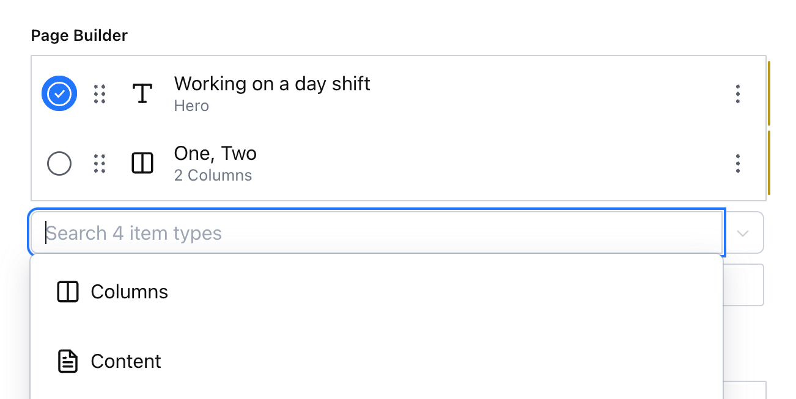

# sanity-plugin-advanced-array

An example implementation for adding copy/paste, multi-select, and inline editing to array fields in Sanity Studio.



> [!WARNING]
> This plugin is an **experiment** and not recommended for production use
> There are known issues with virtualized lists and presence indicators
> There may be issues with performance
> It also uses an unstable Studio Configuration API

- [sanity-plugin-advanced-array](#sanity-plugin-advanced-array)
  - [Installation](#installation)
  - [Usage](#usage)
  - [Options](#options)
    - [`select` (boolean) (default: `true`)](#select-boolean-default-true)
    - [`inline` ('collapsed' | 'expanded' | 'off') (default: `collapsed`)](#inline-collapsed--expanded--off-default-collapsed)
    - [`addItemSearch` (boolean) (default: `false`)](#additemsearch-boolean-default-false)
    - [`__unstable_addItemHidden` (boolean | (value: KeyedObject\[\]) =\> boolean) (default: `false`)](#__unstable_additemhidden-boolean--value-keyedobject--boolean-default-false)
  - [License](#license)
  - [Develop \& test](#develop--test)
    - [Release new version](#release-new-version)

Supports:

- Multi-select to duplicate or delete items
- Copy and paste items between array fields and between documents
- Inline editing with collapsible items
- A searchable box for adding a new item

Does not support:

- Multi-select to reorder items (potentially could be added)
- Reorder items while inline editing (unlikely to be added)

Unstable support:

- Hide the "Add item" button (marked as unstable as it uses a beta part of the API which could change in future non-major versions of Sanity Studio)

## Installation

This plugin is not published to npm, you would need to install it from GitHub directly into your Studio

## Usage

First, add it as a plugin in `sanity.config.ts`

```ts
// ./sanity.config.ts

import {defineConfig} from 'sanity'
import {advancedArray} from './src/plugins/advancedArray'

export default defineConfig({
  // ...other config
  plugins: [
    // ...other plugins
    advancedArray(),
  ],
})
```

Then, update any `array` schema field with an `advanced` property in options.

```ts
import {defineType, defineField} from 'sanity'

export const shoppingListType = defineType({
  name: 'shoppingList',
  title: 'Shopping List',
  type: 'array',
  of: [{
    defineField({name: 'listItem', type: 'listItem'})
  }],
  options: {
    advanced: {
      select: true,
      inline: 'expanded',
    }
  }
})
```

## Options

### `select` (boolean) (default: `true`)

When true, displays a multi-select checkbox for each item in the array.

### `inline` ('collapsed' | 'expanded' | 'off') (default: `collapsed`)

When `'collapsed'`, all items will be collapsed by default.

When `'expanded'`, all items will be expanded by default.

When `'off'`, all items will have the default modal behavior and the collapse button will be hidden.

### `addItemSearch` (boolean) (default: `false`)

When true, displays a search box for adding new items. You might also want to set `__unstable_addItemHidden` to `true` to hide the "Add item" button.

### `__unstable_addItemHidden` (boolean | (value: KeyedObject[]) => boolean) (default: `false`)

When true, hides the "Add item" button.

When false, shows the "Add item" button.

When a function, the function will be called with the current value of the array field and should return a boolean. For example, to remove the "Add item" button when the array has 5 or more items:

```ts
advanced: {
  __unstable_addItemHidden: (value) => value?.length >= 5,
}
```

## License

[MIT](LICENSE) © Simeon Griggs

## Develop & test

This plugin uses [@sanity/plugin-kit](https://github.com/sanity-io/plugin-kit)
with default configuration for build & watch scripts.

See [Testing a plugin in Sanity Studio](https://github.com/sanity-io/plugin-kit#testing-a-plugin-in-sanity-studio)
on how to run this plugin with hotreload in the studio.

### Release new version

Run ["CI & Release" workflow](https://github.com/SimeonGriggs/sanity-plugin-advanced-array/actions/workflows/main.yml).
Make sure to select the main branch and check "Release new version".

Semantic release will only release on configured branches, so it is safe to run release on any branch.
